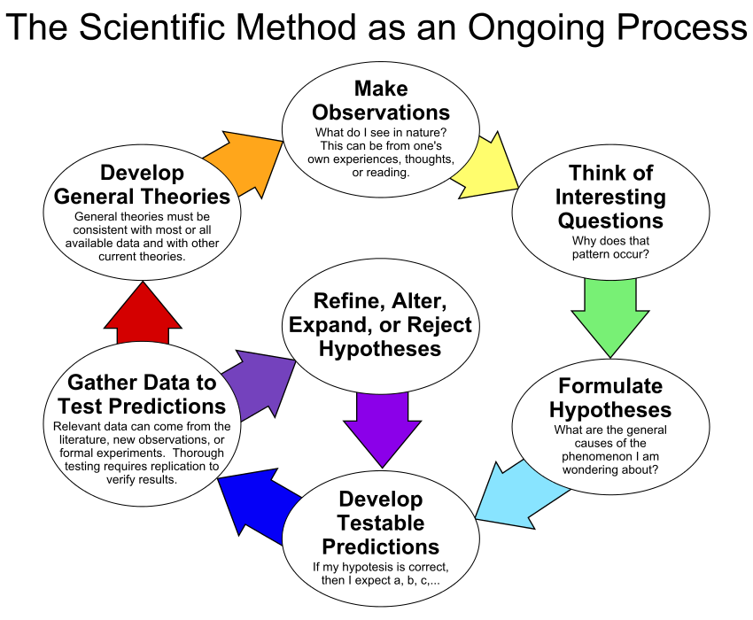
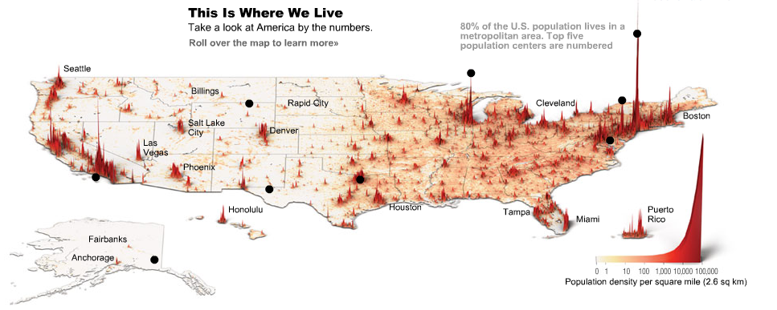
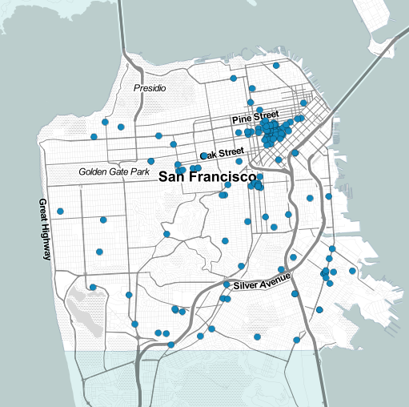

```{r preamble, results='hide', echo=F, warning=F, message=F}
library(ggplot2)
library(dplyr)
library(stringr)
library(scales)
```

# Science, Experiments, Data

## The Scientific Method {data-transition="none-out"}



## The Scientific Method {data-transition="none-in"}


# How do you look at data?
```{r, echo=F, results='hide'}
d <- read.csv('TVratings.csv', stringsAsFactors=F)
```

## Bar charts & Histograms
```{r fig.height=4, echo=F}
p <- ggplot(d, aes(x=Network, y = Viewers2015))+geom_bar(stat='identity')+
  scale_y_continuous('Number of viewers (2015)', labels=comma)+theme_minimal()+
  theme(axis.text.x = element_text(angle=45, hjust=1))
print(p)
```

## Pie charts
```{r, echo=F, fig.height=4}
p <- ggplot(d, aes(x=1, y=Viewers2015, fill=Network))+geom_bar(stat='identity')+
  theme_minimal()+theme(axis.text=element_blank())+coord_polar(theta='y')+
  labs(x='', y='Proportion of viewers by network (2015)')
print(p)

```

## Scatter plots {data-transition='none-out'}
```{r, fig.height=4, echo=F}
p <- ggplot(d, aes(x=Viewers2014, y = Viewers2015, group=Network, color=Network))+geom_point()+
  theme_minimal()+
  scale_x_continuous('Number of viewers (2014)', label=comma)+
  scale_y_continuous('Number of viewers (2015)', label=comma)
print(p)
```

## Scatter plots {data-transition='none-in'}
```{r, fig.height=4, echo=F}
print(p+geom_abline(color='grey'))
```

# From graphs to visualizations

## Data Storytelling

+ Data is not information!!!
+ Data has to be converted to information
+ That information can _inform_ us, tell a story
+ Gain understanding, gain knowledge, plan for the future

+ Some of the best are __New York Times__ and __The Guardian__

## Data as Art

+ Humans understand pictures better than words
+ An artistic viewpoint helps express the story in data
+ Technology allows us to create dynamic (moving) pictures to tell the story

# Where do we live? 

## A common visualization {data-transition="none-out"}


## Better? {data-transition="none-in"}



# Drugs in San Francisco

## Plotting points



## In 3-D


## As art


# What do STEM workers study?

## A Sankey diagram

<a href="https://www.census.gov/dataviz/visualizations/stem/stem-html/"  target="_blank"></a>

# School funding per student

## 
<a href="http://www.npr.org/2016/04/18/474256366/why-americas-schools-have-a-money-problem#responsive-embed-school-funding-map-20160408" target="_blank"></a>

# When should you work?

## 


## It turns out great minds don't work alike!!!
    
# A game changer

## 200 Countries, 200 Years, 4 minutes

<a href='http://www.youtube.com/watch?v=jbkSRLYSojo'  target="_blank"></a>


