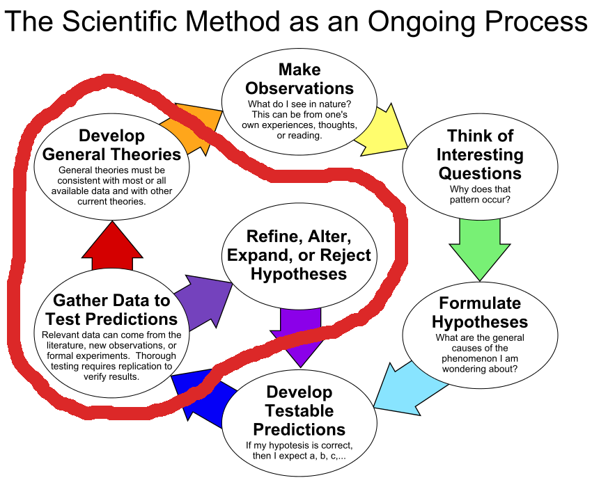
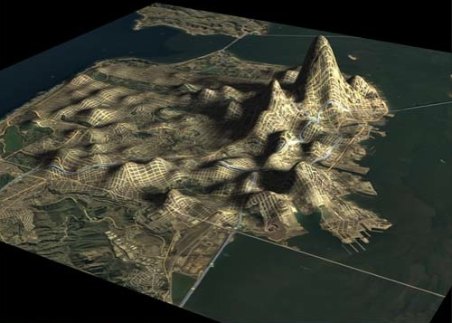
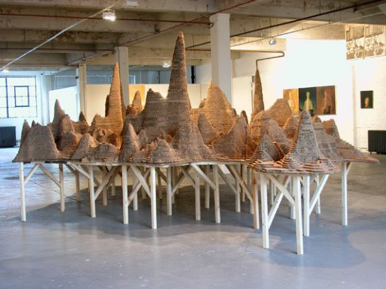
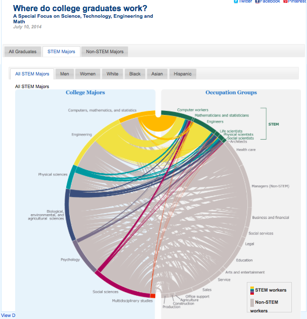
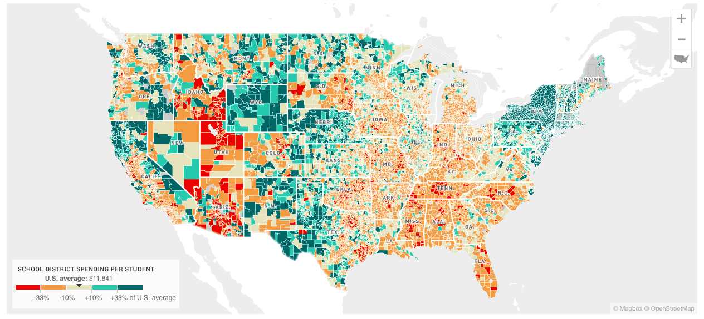

```{r preamble, results='hide', echo=F, warning=F, message=F}
library(ggplot2)
library(dplyr)
library(stringr)
library(scales)
```

# Science, Experiments, Data

## The Scientific Method {data-transition="none-out"}


## The Scientific Method {data-transition="none-in"}



# How do you look at data?
```{r, echo=F, results='hide'}
d <- read.csv('TVratings.csv', stringsAsFactors=F)
```

## Bar charts & Histograms
```{r fig.height=4, echo=F}
p <- ggplot(d, aes(x=Network, y = Viewers2015))+geom_bar(stat='identity')+
  scale_y_continuous('Number of viewers (2015)', labels=comma)+theme_minimal()+
  theme(axis.text.x = element_text(angle=45, hjust=1))
print(p)
```

## Pie charts
```{r, echo=F, fig.height=4}
p <- ggplot(d, aes(x=1, y=Viewers2015, fill=Network))+geom_bar(stat='identity')+
  theme_minimal()+theme(axis.text=element_blank())+coord_polar(theta='y')+
  labs(x='', y='Proportion of viewers by network (2015)')
print(p)

```

## Scatter plots {data-transition='none-out'}
```{r, fig.height=4, echo=F}
p <- ggplot(d, aes(x=Viewers2014, y = Viewers2015, group=Network, color=Network))+geom_point()+
  theme_minimal()+
  scale_x_continuous('Number of viewers (2014)', label=comma)+
  scale_y_continuous('Number of viewers (2015)', label=comma)
print(p)
```

## Scatter plots {data-transition='none-in'}
```{r, fig.height=4, echo=F}
print(p+geom_abline(color='grey'))
```

# From graphs to visualizations

## Visualization is <br/> using Art to <br/> display Information <br/> derived from Data 


## Data as Art

+ We process visual information __60,000 times__ faster than text information
+ An artistic viewpoint helps express the story in data
+ Technology allows us to create dynamic (moving) pictures to tell the story

+ Some of the best are __New York Times__ and __The Guardian__

## We produce a lot of data (6 ZettaBytes/year)


# Where do we live? 

## A common visualization {data-transition="none-out"}


## Better? {data-transition="none-in"}


# Drugs in San Francisco

## Plotting points


## In 3-D


## As art


# Educational imagery

## What do STEM workers study?

<a href="https://www.census.gov/dataviz/visualizations/stem/stem-html/"  target="_blank"></a>

## School funding per student

<a href="http://www.npr.org/2016/04/18/474256366/why-americas-schools-have-a-money-problem#responsive-embed-school-funding-map-20160408" target="_blank"></a>

# When should you work?

## 


## It turns out great minds don't work alike!!!

# Sports

## NCAA tournament brackets

<a href="http://thepowerrank.com/ncaa-tournament-predictions/" target="_blank"></a>

## Basketball shots


## Describing a basketball game

<a href="http://www.nytimes.com/interactive/2012/06/11/sports/basketball/nba-shot-analysis.html?_r=0" target="_blank">
	</a>

## Soccer


# Words

## Cats!!


# Money, money, money

## Spending at home

<a href="http://flowingdata.com/2015/04/02/how-we-spend-our-money-a-breakdown/" target="_blank"></a>

## At the movies


## Countries

<a href="http://www.theguardian.com/world/ng-interactive/2015/aug/26/china-economic-slowdown-world-imports" target="_blank"></a>

# Weather wizards

## Summarizing a year in the city


## The power of the wind
<a href="http://hint.fm/wind/" target="_blank">
  
</a>

# Visualizing war

##

<a href="http://drones.pitchinteractive.com" target="_blank"></a>

# A game changer

## 200 Countries, 200 Years, 4 minutes

<a href='http://www.youtube.com/watch?v=jbkSRLYSojo'  target="_blank"></a>


